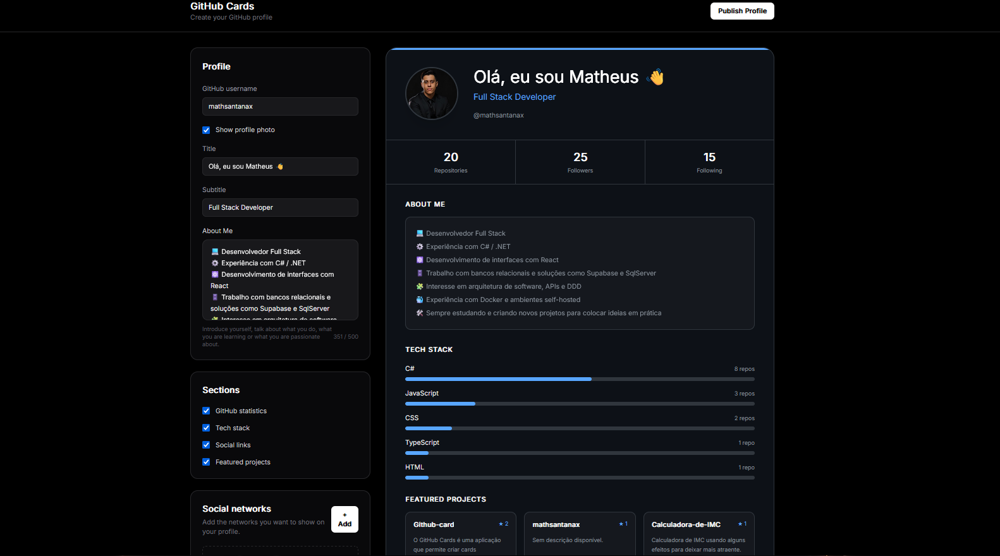

# GitHub Cards

<p align="center">
  
</p>

<p align="center">
  Crie cards personalizados do seu perfil do GitHub para usar em READMEs, portfólios e projetos.
</p>

<p align="center">
  
  
  
  
</p>

---

## ✨ Sobre

**GitHub Cards** é uma aplicação para criar cards personalizados a partir de perfis do GitHub.

O projeto permite selecionar quais informações serão exibidas e personalizar a aparência do card, incluindo cores, gradientes, fontes, avatar, estatísticas, tecnologias, redes sociais, projetos e animações.

Os cards podem ser gerados em **SVG**, permitindo utilizá-los em diferentes projetos e páginas.

## 🚀 Funcionalidades

* 🔎 Busca de perfis do GitHub
* 👤 Avatar e informações do perfil
* 📊 Estatísticas do GitHub
* 💻 Tecnologias mais utilizadas
* 🔗 Redes sociais
* ⭐ Projetos em destaque
* 🎨 Cores e gradientes personalizados
* 🔤 Seleção de fontes
* 🖼️ Diferentes estilos de avatar
* ✨ Animações
* 📦 Geração do card em SVG
* 🔗 API para geração dinâmica dos cards

## 🎨 Personalização

O card pode ser configurado de acordo com o estilo desejado:

* Cor de fundo
* Gradiente
* Cor de destaque
* Cor do texto
* Cor das bordas
* Fonte
* Estilo do avatar
* Exibição de estatísticas
* Tecnologias
* Redes sociais
* Projetos
* Animações

## 🛠️ Tecnologias

### Frontend

* React
* TypeScript
* Vite
* Tailwind CSS

### Backend / API

* Vercel Functions
* GitHub REST API
* SVG

### Deploy

* Vercel

## 📦 Instalação

Clone o repositório:

```bash
git clone https://github.com/SEU-USUARIO/github-cards.git
```

Entre na pasta:

```bash
cd github-cards
```

Instale as dependências:

```bash
npm install
```

Execute o projeto:

```bash
npm run dev
```

O projeto estará disponível em:

```text
http://localhost:5173
```

## 🔌 API

Depois de publicado, o card pode ser consumido diretamente através da API:

```text
/api/card?data=CONFIGURACAO
```

Isso permite utilizar o card dinamicamente em outros projetos, páginas ou documentos que suportem SVG.

## 📸 Preview

<p align="center">
  
</p>

## 📁 Estrutura

```text
github-cards/
├── api/
│   ├── card.ts
│   ├── card-encoder.ts
│   └── card-utils.ts
│
├── public/
│   └── github-cards-preview.png
│
├── src/
│   ├── components/
│   ├── pages/
│   ├── types/
│   └── ...
│
├── .gitignore
├── package.json
├── tsconfig.json
├── vite.config.ts
└── README.md
```

## 🌐 Deploy

O projeto pode ser publicado facilmente na Vercel.

Após conectar o repositório, a aplicação pode ser automaticamente atualizada a cada novo push na branch principal.

## 👨‍💻 Autor

Desenvolvido por **Matheus Santana**.

<p>
  <a href="https://github.com/mathsantanax">
    
  </a>
</p>

---

<p align="center">
  ⭐ Se este projeto foi útil ou interessante para você, considere deixar uma estrela no repositório.
</p>
